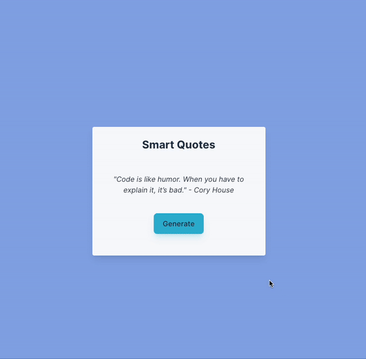

# OpenAI Quote Generator

Poking around OpenAI, so I decided to build a quote generator to start.

## Tech:
- React/Vite
- Tailwind CSS
- TypeScript

## Need:
- copy `.env.template` > `.env` 
- add openai key. New accounts get $18 free credits (mine expired unfornately)

### TODO's:
- Get prettier to work for long strings :(

## Considerations
- I did not bother since this is just for experimenting, but maybe it would be
interesting to add sockets to stream the quotes instead of waiting for the entire response. It does take a while.
- Fixed size on the container